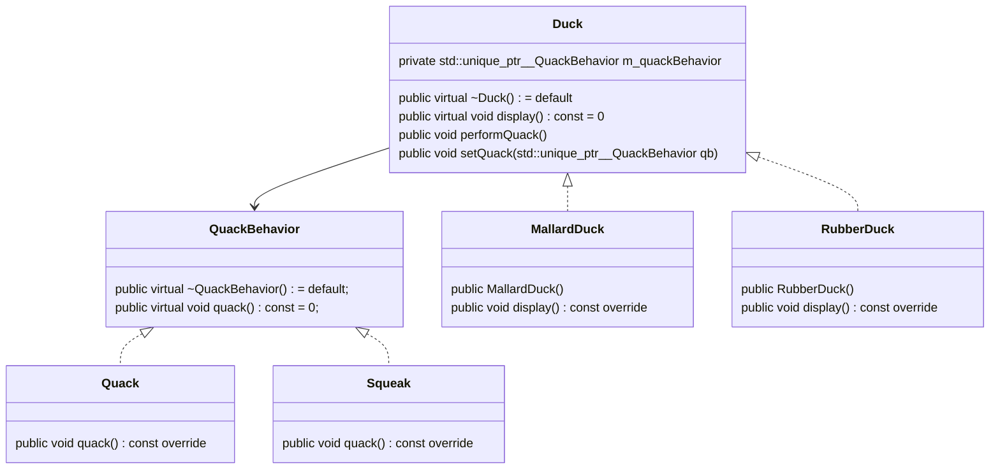

# design-patterns

C++ examples for the book _Head First Design Patterns 2e._ Simplified to minimal examples and adapted to C++ conventions.

## Strategy Pattern

The Strategy Pattern defines a family of algorithms,
encapsulates each one, and makes them interchangeable.
Strategy lets the algorithm vary independently from
clients that use it.

