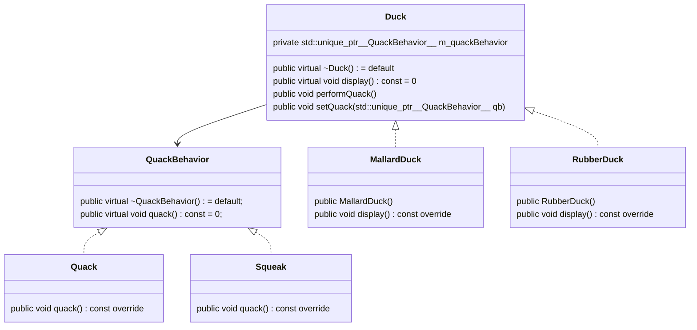
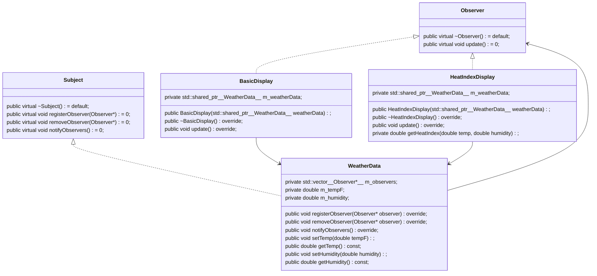
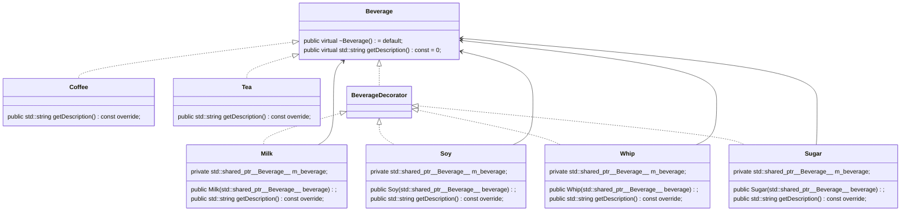
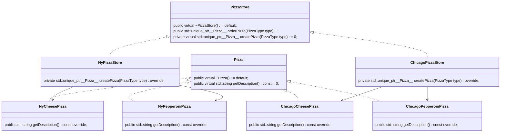
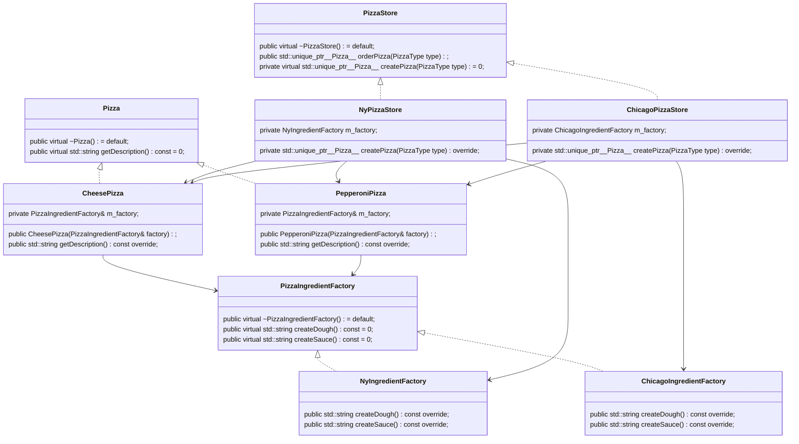

# design-patterns

C++ examples for the book _Head First Design Patterns 2e._ Simplified to minimal examples and adapted to C++ conventions.

## Strategy Pattern

The Strategy Pattern defines a family of algorithms,
encapsulates each one, and makes them interchangeable.
Strategy lets the algorithm vary independently from
clients that use it.

## Observer Pattern

The Observer Pattern defines a one-to-many dependency between objects so that when one object changes state, all of its dependents are notified and updated automatically.

## Decorator Pattern

The Decorator Pattern attaches additional responsibilities to an object dynamically. Decorators provide a flexible alternative to subclassing for extending functionality.

## Factory Method Pattern

The Factory Method Pattern defines an interface for creating an object, but lets subclasses decide which class to instantiate. Factory Method lets a class defer instantiation to subclasses.

## Abstract Factory Pattern

The Abstract Factory Pattern provides an interface for creating families of related or dependent objects without specifying their concrete classes.

