# design-patterns

C++ examples for the book _Head First Design Patterns 2e._ Simplified to minimal examples and adapted to C++ conventions.

## Patterns

| Pattern | Category | Intent |
|---------|----------|--------|
| [Strategy](#strategy-pattern) | Behavioral | Define a family of algorithms, encapsulate each one, and make them interchangeable |
| [Observer](#observer-pattern) | Behavioral | Define a one-to-many dependency so all dependents are notified when one object changes state |
| [Decorator](#decorator-pattern) | Structural | Attach additional responsibilities to an object dynamically, as a flexible alternative to subclassing |
| [Factory Method](#factory-method-pattern) | Creational | Define an interface for creating an object, but let subclasses decide which class to instantiate |
| [Abstract Factory](#abstract-factory-pattern) | Creational | Provide an interface for creating families of related objects without specifying concrete classes |
| [Command](#command-pattern) | Behavioral | Encapsulate a request as an object to support undo, queuing, and parameterization |
| [Adapter](#adapter-pattern) | Structural | Convert the interface of a class into another interface clients expect |
| [Facade](#facade-pattern) | Structural | Provide a unified interface to a set of interfaces in a subsystem |
| [Template Method](#template-method-pattern) | Behavioral | Define the skeleton of an algorithm in a base class, deferring steps to subclasses |
| [Iterator](#iterator-pattern) | Behavioral | Access elements of a collection sequentially without exposing its underlying representation |
| [Composite](#composite-pattern) | Structural | Compose objects into tree structures so clients treat individual objects and compositions uniformly |
| [State](#state-pattern) | Behavioral | Allow an object to alter its behavior when its internal state changes |
| [Proxy](#proxy-pattern) | Structural | Provide a surrogate or placeholder for another object to control access to it |

## Build

```
./build.sh
```

## Run

```
./run.sh              # run all examples
./run.sh <pattern>    # run one example, e.g. ./run.sh strategy
./run.sh -h           # list available patterns
```

---

## Strategy Pattern

> The Strategy Pattern defines a family of algorithms, encapsulates each one, and makes them interchangeable. Strategy lets the algorithm vary independently from clients that use it.

`Duck` holds a `FlyBehavior` and `QuackBehavior` by composition rather than inheriting separate fly/quack variations. `MallardDuck`, `RubberDuck`, and `ModelDuck` each inject different behaviors in their constructors. `main.cpp` then swaps `ModelDuck`'s fly behavior at runtime via `setFlyBehavior()`, showing that the algorithm varies independently from the duck that uses it.

<details>
<summary>Class diagram</summary>

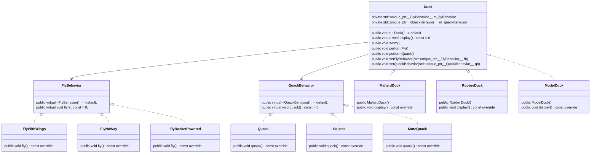
```mermaid
classDiagram

class FlyBehavior {
    public virtual ~FlyBehavior() = default;
    public virtual void fly() const = 0;
}

class FlyWithWings {
    public void fly() const override
}

class FlyNoWay {
    public void fly() const override
}

class FlyRocketPowered {
    public void fly() const override
}

class QuackBehavior {
    public virtual ~QuackBehavior() = default;
    public virtual void quack() const = 0;
}

class Quack {
    public void quack() const override
}

class Squeak {
    public void quack() const override
}

class MuteQuack {
    public void quack() const override
}

class Duck {
    public virtual ~Duck() = default
    public virtual void display() const = 0
    public void swim()
    public void performFly()
    public void performQuack()
    public void setFlyBehavior(std::unique_ptr__FlyBehavior__ fb)
    public void setQuackBehavior(std::unique_ptr__QuackBehavior__ qb)
    private std::unique_ptr__FlyBehavior__ m_flyBehavior
    private std::unique_ptr__QuackBehavior__ m_quackBehavior
}

class MallardDuck {
    public MallardDuck()
    public void display() const override
}

class RubberDuck {
    public RubberDuck()
    public void display() const override
}

class ModelDuck {
    public ModelDuck()
    public void display() const override
}

Duck <|.. MallardDuck
Duck <|.. RubberDuck
Duck <|.. ModelDuck
Duck --> FlyBehavior
Duck --> QuackBehavior
FlyBehavior <|.. FlyWithWings
FlyBehavior <|.. FlyNoWay
FlyBehavior <|.. FlyRocketPowered
QuackBehavior <|.. Quack
QuackBehavior <|.. Squeak
QuackBehavior <|.. MuteQuack
```

</details>

---

## Observer Pattern

> The Observer Pattern defines a one-to-many dependency between objects so that when one object changes state, all of its dependents are notified and updated automatically.

`WeatherData` is the subject; `CurrentConditionsDisplay`, `StatisticsDisplay`, and `ForecastDisplay` are observers. Each display registers itself with `WeatherData` on construction and deregisters in its destructor (RAII). Calling `setMeasurements()` triggers `notifyObservers()`, which calls `update()` on every registered display. The displays use the pull model — they call `getTemp()` and `getHumidity()` on the subject inside `update()` rather than receiving data as arguments.

<details>
<summary>Class diagram</summary>

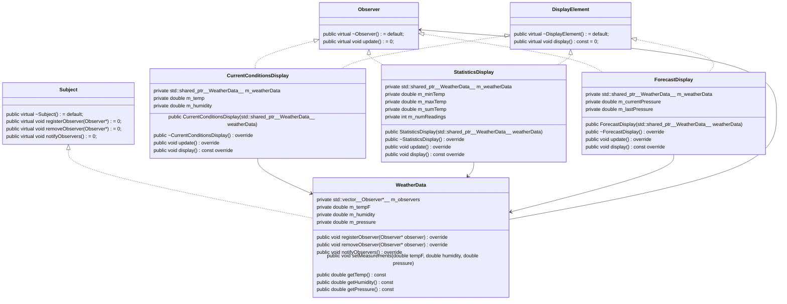
```mermaid
classDiagram

class Observer {
    public virtual ~Observer() = default;
    public virtual void update() = 0;
}

class DisplayElement {
    public virtual ~DisplayElement() = default;
    public virtual void display() const = 0;
}

class Subject {
    public virtual ~Subject() = default;
    public virtual void registerObserver(Observer*) = 0;
    public virtual void removeObserver(Observer*) = 0;
    public virtual void notifyObservers() = 0;
}

class WeatherData {
    public void registerObserver(Observer* observer) override
    public void removeObserver(Observer* observer) override
    public void notifyObservers() override
    public void setMeasurements(double tempF, double humidity, double pressure)
    public double getTemp() const
    public double getHumidity() const
    public double getPressure() const
    private std::vector__Observer*__ m_observers
    private double m_tempF
    private double m_humidity
    private double m_pressure
}

class CurrentConditionsDisplay {
    public CurrentConditionsDisplay(std::shared_ptr__WeatherData__ weatherData)
    public ~CurrentConditionsDisplay() override
    public void update() override
    public void display() const override
    private std::shared_ptr__WeatherData__ m_weatherData
    private double m_temp
    private double m_humidity
}

class StatisticsDisplay {
    public StatisticsDisplay(std::shared_ptr__WeatherData__ weatherData)
    public ~StatisticsDisplay() override
    public void update() override
    public void display() const override
    private std::shared_ptr__WeatherData__ m_weatherData
    private double m_minTemp
    private double m_maxTemp
    private double m_sumTemp
    private int m_numReadings
}

class ForecastDisplay {
    public ForecastDisplay(std::shared_ptr__WeatherData__ weatherData)
    public ~ForecastDisplay() override
    public void update() override
    public void display() const override
    private std::shared_ptr__WeatherData__ m_weatherData
    private double m_currentPressure
    private double m_lastPressure
}

Subject <|.. WeatherData
Observer <|.. CurrentConditionsDisplay
Observer <|.. StatisticsDisplay
Observer <|.. ForecastDisplay
DisplayElement <|.. CurrentConditionsDisplay
DisplayElement <|.. StatisticsDisplay
DisplayElement <|.. ForecastDisplay
WeatherData --> Observer
CurrentConditionsDisplay --> WeatherData
StatisticsDisplay --> WeatherData
ForecastDisplay --> WeatherData
```

</details>

---

## Decorator Pattern

> The Decorator Pattern attaches additional responsibilities to an object dynamically. Decorators provide a flexible alternative to subclassing for extending functionality.

`Espresso`, `HouseBlend`, and `DarkRoast` are base beverages. `Milk`, `Mocha`, `Soy`, and `Whip` are decorators that each wrap a `shared_ptr<Beverage>` and delegate `cost()` and `getDescription()` down the chain, appending their own contribution. `main.cpp` chains multiple decorators onto a single beverage — e.g. a `DarkRoast` wrapped with two `Mocha`s and a `Whip` — showing how responsibilities accumulate without subclassing.

<details>
<summary>Class diagram</summary>

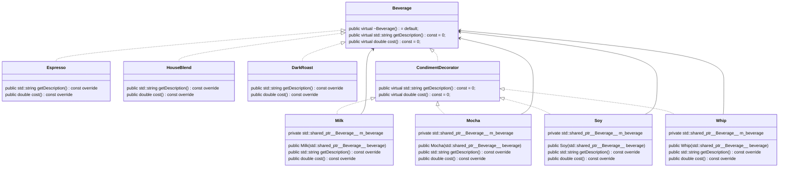
```mermaid
classDiagram

class Beverage {
    public virtual ~Beverage() = default;
    public virtual std::string getDescription() const = 0;
    public virtual double cost() const = 0;
}

class Espresso {
    public std::string getDescription() const override
    public double cost() const override
}

class HouseBlend {
    public std::string getDescription() const override
    public double cost() const override
}

class DarkRoast {
    public std::string getDescription() const override
    public double cost() const override
}

class CondimentDecorator {
    public virtual std::string getDescription() const = 0;
    public virtual double cost() const = 0;
}

class Milk {
    public Milk(std::shared_ptr__Beverage__ beverage)
    public std::string getDescription() const override
    public double cost() const override
    private std::shared_ptr__Beverage__ m_beverage
}

class Mocha {
    public Mocha(std::shared_ptr__Beverage__ beverage)
    public std::string getDescription() const override
    public double cost() const override
    private std::shared_ptr__Beverage__ m_beverage
}

class Soy {
    public Soy(std::shared_ptr__Beverage__ beverage)
    public std::string getDescription() const override
    public double cost() const override
    private std::shared_ptr__Beverage__ m_beverage
}

class Whip {
    public Whip(std::shared_ptr__Beverage__ beverage)
    public std::string getDescription() const override
    public double cost() const override
    private std::shared_ptr__Beverage__ m_beverage
}

Beverage <|.. Espresso
Beverage <|.. HouseBlend
Beverage <|.. DarkRoast
Beverage <|.. CondimentDecorator
CondimentDecorator <|.. Milk
CondimentDecorator <|.. Mocha
CondimentDecorator <|.. Soy
CondimentDecorator <|.. Whip
Milk --> Beverage
Mocha --> Beverage
Soy --> Beverage
Whip --> Beverage
```

</details>

---

## Factory Method Pattern

> The Factory Method Pattern defines an interface for creating an object, but lets subclasses decide which class to instantiate. Factory Method lets a class defer instantiation to subclasses.

`PizzaStore::orderPizza()` is the invariant — it calls `createPizza()`, then prepares, bakes, cuts, and boxes the result. `createPizza()` is the factory method: `NyPizzaStore` overrides it to create NY-style pizzas, `ChicagoPizzaStore` to create Chicago-style. The client calls `orderPizza()` on the store without knowing which concrete `Pizza` subclass will be instantiated.

<details>
<summary>Class diagram</summary>


```mermaid
classDiagram

class Pizza {
    public virtual ~Pizza() = default;
    public virtual std::string getName() const = 0;
    public void prepare()
    public void bake()
    public void cut()
    public void box()
    protected virtual void doCut()
}

class NyCheesePizza {
    public std::string getName() const override
}

class NyVeggiePizza {
    public std::string getName() const override
}

class NyClamPizza {
    public std::string getName() const override
}

class NyPepperoniPizza {
    public std::string getName() const override
}

class ChicagoCheesePizza {
    public std::string getName() const override
    protected void doCut() override
}

class ChicagoVeggiePizza {
    public std::string getName() const override
    protected void doCut() override
}

class ChicagoClamPizza {
    public std::string getName() const override
    protected void doCut() override
}

class ChicagoPepperoniPizza {
    public std::string getName() const override
    protected void doCut() override
}

class PizzaStore {
    public virtual ~PizzaStore() = default;
    public std::unique_ptr__Pizza__ orderPizza(PizzaType type)
    private virtual std::unique_ptr__Pizza__ createPizza(PizzaType type) = 0
}

class NyPizzaStore {
    private std::unique_ptr__Pizza__ createPizza(PizzaType type) override
}

class ChicagoPizzaStore {
    private std::unique_ptr__Pizza__ createPizza(PizzaType type) override
}

Pizza <|.. NyCheesePizza
Pizza <|.. NyVeggiePizza
Pizza <|.. NyClamPizza
Pizza <|.. NyPepperoniPizza
Pizza <|.. ChicagoCheesePizza
Pizza <|.. ChicagoVeggiePizza
Pizza <|.. ChicagoClamPizza
Pizza <|.. ChicagoPepperoniPizza
PizzaStore <|.. NyPizzaStore
PizzaStore <|.. ChicagoPizzaStore
```

</details>

---

## Abstract Factory Pattern

> The Abstract Factory Pattern provides an interface for creating families of related or dependent objects without specifying their concrete classes.

`CheesePizza`, `ClamPizza`, and `PepperoniPizza` each receive a `PizzaIngredientFactory&` in their constructor and call its methods in `prepare()` to get regional ingredients. `NyPizzaStore` owns an `NyIngredientFactory`; `ChicagoPizzaStore` owns a `ChicagoIngredientFactory`. The same `CheesePizza` class produces a different pizza depending on which factory it receives — the factory determines the product family, not the pizza subclass.

<details>
<summary>Class diagram</summary>

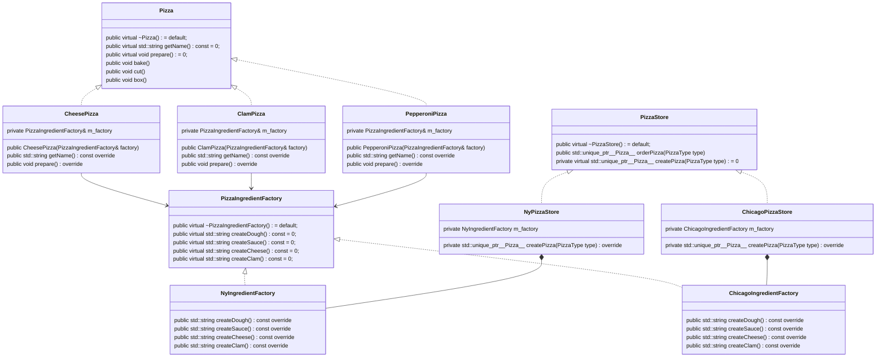
```mermaid
classDiagram

class PizzaIngredientFactory {
    public virtual ~PizzaIngredientFactory() = default;
    public virtual std::string createDough() const = 0;
    public virtual std::string createSauce() const = 0;
    public virtual std::string createCheese() const = 0;
    public virtual std::string createClam() const = 0;
}

class NyIngredientFactory {
    public std::string createDough() const override
    public std::string createSauce() const override
    public std::string createCheese() const override
    public std::string createClam() const override
}

class ChicagoIngredientFactory {
    public std::string createDough() const override
    public std::string createSauce() const override
    public std::string createCheese() const override
    public std::string createClam() const override
}

class Pizza {
    public virtual ~Pizza() = default;
    public virtual std::string getName() const = 0;
    public virtual void prepare() = 0;
    public void bake()
    public void cut()
    public void box()
}

class CheesePizza {
    public CheesePizza(PizzaIngredientFactory& factory)
    public std::string getName() const override
    public void prepare() override
    private PizzaIngredientFactory& m_factory
}

class ClamPizza {
    public ClamPizza(PizzaIngredientFactory& factory)
    public std::string getName() const override
    public void prepare() override
    private PizzaIngredientFactory& m_factory
}

class PepperoniPizza {
    public PepperoniPizza(PizzaIngredientFactory& factory)
    public std::string getName() const override
    public void prepare() override
    private PizzaIngredientFactory& m_factory
}

class PizzaStore {
    public virtual ~PizzaStore() = default;
    public std::unique_ptr__Pizza__ orderPizza(PizzaType type)
    private virtual std::unique_ptr__Pizza__ createPizza(PizzaType type) = 0
}

class NyPizzaStore {
    private std::unique_ptr__Pizza__ createPizza(PizzaType type) override
    private NyIngredientFactory m_factory
}

class ChicagoPizzaStore {
    private std::unique_ptr__Pizza__ createPizza(PizzaType type) override
    private ChicagoIngredientFactory m_factory
}

PizzaIngredientFactory <|.. NyIngredientFactory
PizzaIngredientFactory <|.. ChicagoIngredientFactory
Pizza <|.. CheesePizza
Pizza <|.. ClamPizza
Pizza <|.. PepperoniPizza
PizzaStore <|.. NyPizzaStore
PizzaStore <|.. ChicagoPizzaStore
CheesePizza --> PizzaIngredientFactory
ClamPizza --> PizzaIngredientFactory
PepperoniPizza --> PizzaIngredientFactory
NyPizzaStore *-- NyIngredientFactory
ChicagoPizzaStore *-- ChicagoIngredientFactory
```

</details>

---

## Command Pattern

> The Command Pattern encapsulates a request as an object, thereby letting you parameterize other objects with different requests, queue or log requests, and support undoable operations.

`RemoteControl` holds an array of on/off `Command` pairs set via `setCommand()`. Pressing a button calls `execute()` on the stored command and saves it to `m_lastCommand`. `undoButtonWasPushed()` calls `undo()` on `m_lastCommand` to reverse the last action. `NoCommand` fills empty slots so no null checks are needed anywhere in the remote.

<details>
<summary>Class diagram</summary>

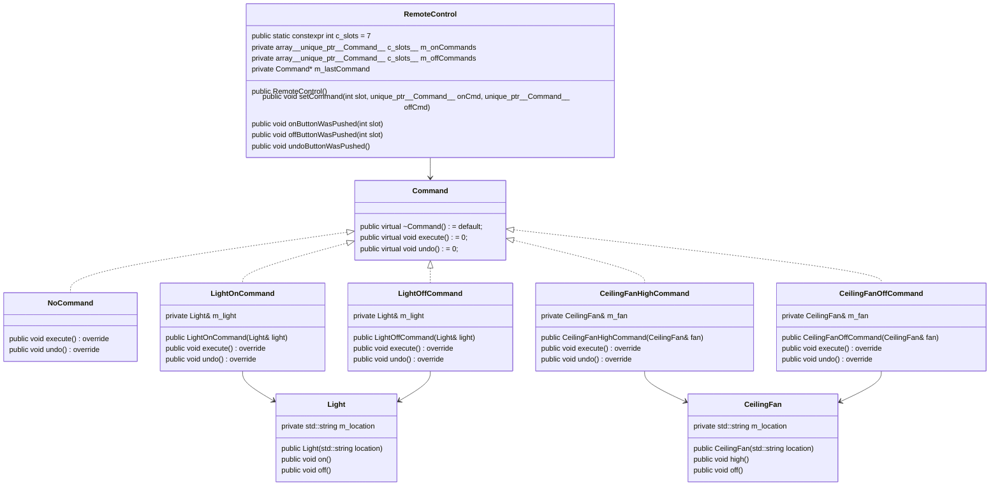
```mermaid
classDiagram

class Command {
    public virtual ~Command() = default;
    public virtual void execute() = 0;
    public virtual void undo() = 0;
}

class NoCommand {
    public void execute() override
    public void undo() override
}

class Light {
    public Light(std::string location)
    public void on()
    public void off()
    private std::string m_location
}

class LightOnCommand {
    public LightOnCommand(Light& light)
    public void execute() override
    public void undo() override
    private Light& m_light
}

class LightOffCommand {
    public LightOffCommand(Light& light)
    public void execute() override
    public void undo() override
    private Light& m_light
}

class CeilingFan {
    public CeilingFan(std::string location)
    public void high()
    public void off()
    private std::string m_location
}

class CeilingFanHighCommand {
    public CeilingFanHighCommand(CeilingFan& fan)
    public void execute() override
    public void undo() override
    private CeilingFan& m_fan
}

class CeilingFanOffCommand {
    public CeilingFanOffCommand(CeilingFan& fan)
    public void execute() override
    public void undo() override
    private CeilingFan& m_fan
}

class RemoteControl {
    public static constexpr int c_slots = 7
    public RemoteControl()
    public void setCommand(int slot, unique_ptr__Command__ onCmd, unique_ptr__Command__ offCmd)
    public void onButtonWasPushed(int slot)
    public void offButtonWasPushed(int slot)
    public void undoButtonWasPushed()
    private array__unique_ptr__Command__ c_slots__ m_onCommands
    private array__unique_ptr__Command__ c_slots__ m_offCommands
    private Command* m_lastCommand
}

Command <|.. NoCommand
Command <|.. LightOnCommand
Command <|.. LightOffCommand
Command <|.. CeilingFanHighCommand
Command <|.. CeilingFanOffCommand
LightOnCommand --> Light
LightOffCommand --> Light
CeilingFanHighCommand --> CeilingFan
CeilingFanOffCommand --> CeilingFan
RemoteControl --> Command
```

</details>

---

## Adapter Pattern

> The Adapter Pattern converts the interface of a class into another interface clients expect. Adapter lets classes work together that couldn't otherwise because of incompatible interfaces.

`WildTurkey` has `gobble()` and a short `fly()`, but the client function `testDuck()` expects the `Duck` interface (`quack()` and `fly()`). `TurkeyAdapter` wraps a `Turkey&` and implements `Duck`, translating `quack()` to `gobble()`. Because `testDuck()` takes a `Duck&`, `TurkeyAdapter` passes in wherever a `GreenHeadDuck` would — the client is unaware of the adaptation.

<details>
<summary>Class diagram</summary>

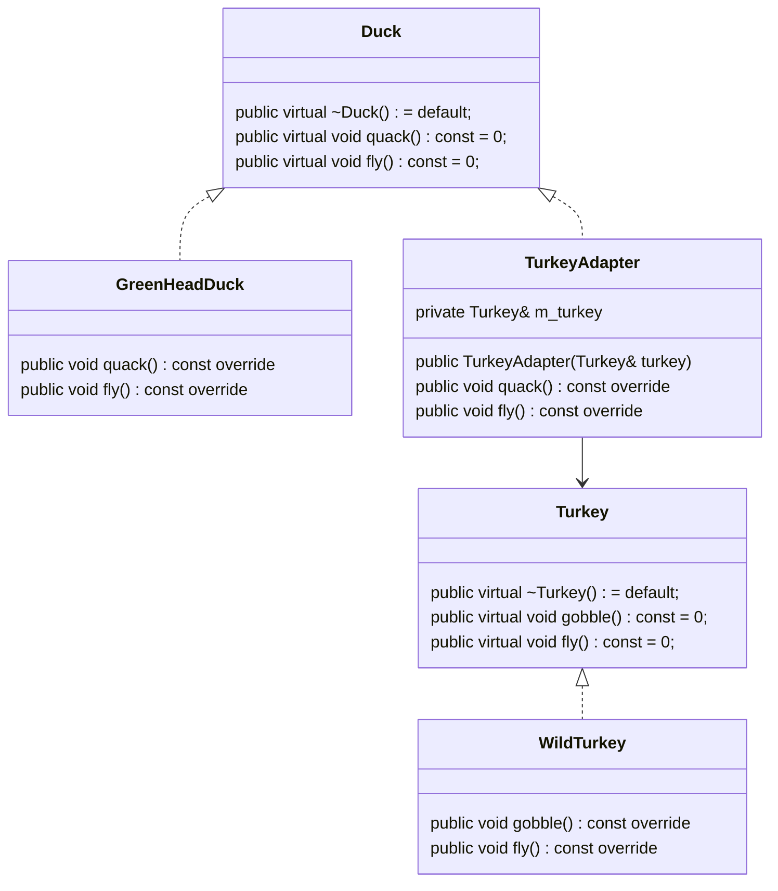
```mermaid
classDiagram

class Duck {
    public virtual ~Duck() = default;
    public virtual void quack() const = 0;
    public virtual void fly() const = 0;
}

class Turkey {
    public virtual ~Turkey() = default;
    public virtual void gobble() const = 0;
    public virtual void fly() const = 0;
}

class GreenHeadDuck {
    public void quack() const override
    public void fly() const override
}

class WildTurkey {
    public void gobble() const override
    public void fly() const override
}

class TurkeyAdapter {
    public TurkeyAdapter(Turkey& turkey)
    public void quack() const override
    public void fly() const override
    private Turkey& m_turkey
}

Duck <|.. GreenHeadDuck
Duck <|.. TurkeyAdapter
Turkey <|.. WildTurkey
TurkeyAdapter --> Turkey
```

</details>

---

## Facade Pattern

> The Facade Pattern provides a unified interface to a set of interfaces in a subsystem. Facade defines a higher-level interface that makes the subsystem easier to use.

Six subsystem classes (`Amplifier`, `DvdPlayer`, `Projector`, `Screen`, `TheaterLights`, `PopcornPopper`) each have their own interface. `HomeTheaterFacade` holds references to all of them and exposes just two methods: `watchMovie()` and `endMovie()`. The client in `main.cpp` constructs the subsystem objects and the facade, then only calls those two methods — all subsystem coordination is hidden behind the facade.

<details>
<summary>Class diagram</summary>

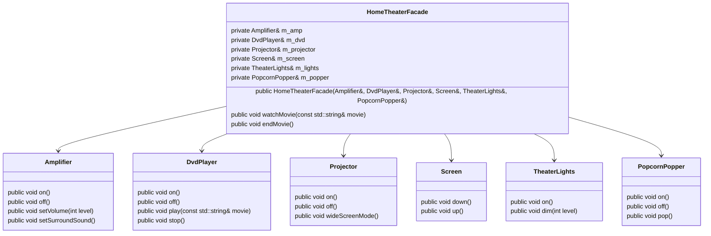
```mermaid
classDiagram

class Amplifier {
    public void on()
    public void off()
    public void setVolume(int level)
    public void setSurroundSound()
}

class DvdPlayer {
    public void on()
    public void off()
    public void play(const std::string& movie)
    public void stop()
}

class Projector {
    public void on()
    public void off()
    public void wideScreenMode()
}

class Screen {
    public void down()
    public void up()
}

class TheaterLights {
    public void on()
    public void dim(int level)
}

class PopcornPopper {
    public void on()
    public void off()
    public void pop()
}

class HomeTheaterFacade {
    public HomeTheaterFacade(Amplifier&, DvdPlayer&, Projector&, Screen&, TheaterLights&, PopcornPopper&)
    public void watchMovie(const std::string& movie)
    public void endMovie()
    private Amplifier& m_amp
    private DvdPlayer& m_dvd
    private Projector& m_projector
    private Screen& m_screen
    private TheaterLights& m_lights
    private PopcornPopper& m_popper
}

HomeTheaterFacade --> Amplifier
HomeTheaterFacade --> DvdPlayer
HomeTheaterFacade --> Projector
HomeTheaterFacade --> Screen
HomeTheaterFacade --> TheaterLights
HomeTheaterFacade --> PopcornPopper
```

</details>

---

## Template Method Pattern

> The Template Method Pattern defines the skeleton of an algorithm in a method, deferring some steps to subclasses. Template Method lets subclasses redefine certain steps of an algorithm without changing the algorithm's structure.

`CaffeineBeverage::prepareRecipe()` is the template method: boil water → brew → pour → conditionally add condiments. `boilWater()` and `pourInCup()` are private non-virtual fixed steps. `brew()` and `addCondiments()` are private pure virtual steps that subclasses must override. `customerWantsCondiments()` is a hook — virtual with a default of `true`, overridden by `SteepedTea` to let the customer opt out. The algorithm structure in `prepareRecipe()` never changes.

<details>
<summary>Class diagram</summary>

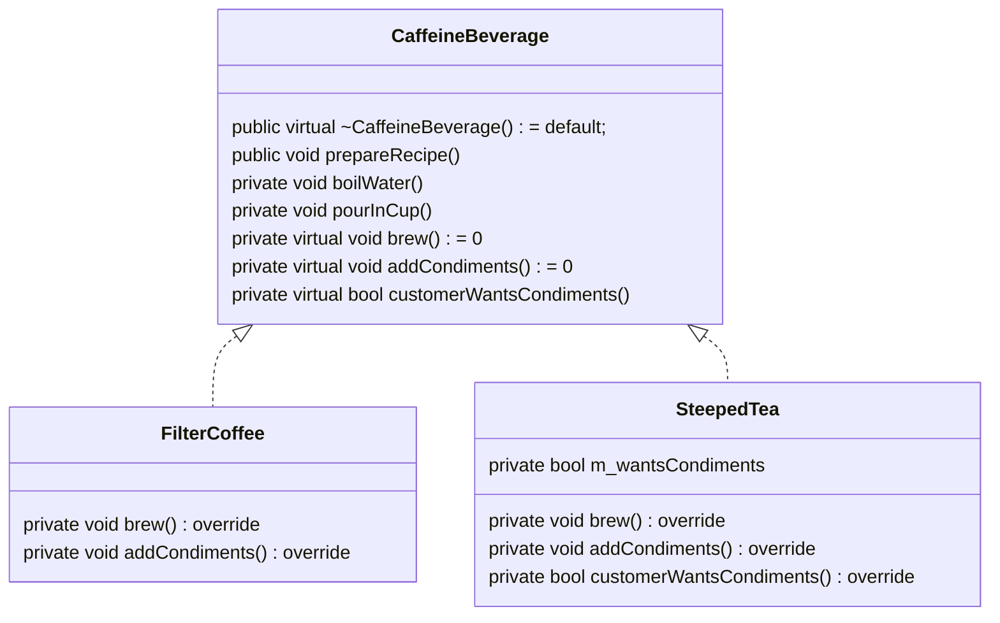
```mermaid
classDiagram

class CaffeineBeverage {
    public virtual ~CaffeineBeverage() = default;
    public void prepareRecipe()
    private void boilWater()
    private void pourInCup()
    private virtual void brew() = 0
    private virtual void addCondiments() = 0
    private virtual bool customerWantsCondiments()
}

class FilterCoffee {
    private void brew() override
    private void addCondiments() override
}

class SteepedTea {
    private bool m_wantsCondiments
    private void brew() override
    private void addCondiments() override
    private bool customerWantsCondiments() override
}

CaffeineBeverage <|.. FilterCoffee
CaffeineBeverage <|.. SteepedTea
```

</details>

---

## Iterator Pattern

> The Iterator Pattern provides a way to access the elements of an aggregate object sequentially without exposing its underlying representation.

`DinerMenu` stores items in a fixed-size `std::array`; `PancakeHouseMenu` stores them in a `std::vector`. Both expose `createIterator()` returning a `std::unique_ptr<Iterator>`. The client function `printMenu()` in `main.cpp` takes an `Iterator&` and traverses either menu identically, with no knowledge of the backing container type.

<details>
<summary>Class diagram</summary>

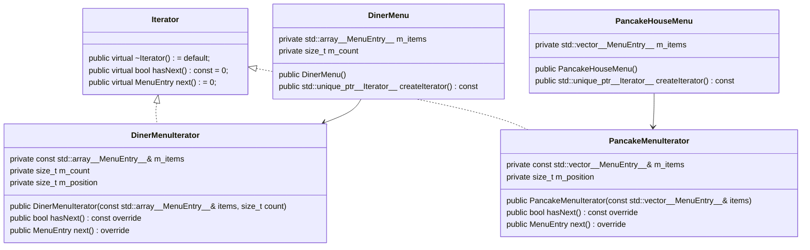
```mermaid
classDiagram

class Iterator {
    public virtual ~Iterator() = default;
    public virtual bool hasNext() const = 0;
    public virtual MenuEntry next() = 0;
}

class DinerMenu {
    public DinerMenu()
    public std::unique_ptr__Iterator__ createIterator() const
    private std::array__MenuEntry__ m_items
    private size_t m_count
}

class DinerMenuIterator {
    public DinerMenuIterator(const std::array__MenuEntry__& items, size_t count)
    public bool hasNext() const override
    public MenuEntry next() override
    private const std::array__MenuEntry__& m_items
    private size_t m_count
    private size_t m_position
}

class PancakeHouseMenu {
    public PancakeHouseMenu()
    public std::unique_ptr__Iterator__ createIterator() const
    private std::vector__MenuEntry__ m_items
}

class PancakeMenuIterator {
    public PancakeMenuIterator(const std::vector__MenuEntry__& items)
    public bool hasNext() const override
    public MenuEntry next() override
    private const std::vector__MenuEntry__& m_items
    private size_t m_position
}

Iterator <|.. DinerMenuIterator
Iterator <|.. PancakeMenuIterator
DinerMenu --> DinerMenuIterator
PancakeHouseMenu --> PancakeMenuIterator
```

</details>

---

## Composite Pattern

> The Composite Pattern allows you to compose objects into tree structures to represent part-whole hierarchies. Composite lets clients treat individual objects and compositions of objects uniformly.

`MenuItem` is the leaf and `Menu` is the composite; both extend `MenuComponent`. `Menu` stores a `vector<unique_ptr<MenuComponent>>` and its `print()` recursively calls `print()` on each child. `main.cpp` builds a tree of menus containing submenus and items, then calls `print()` on the root — the same call works uniformly for leaves and subtrees.

<details>
<summary>Class diagram</summary>

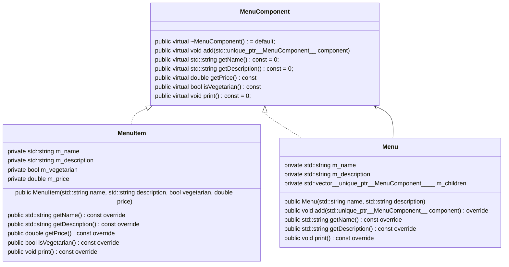
```mermaid
classDiagram

class MenuComponent {
    public virtual ~MenuComponent() = default;
    public virtual void add(std::unique_ptr__MenuComponent__ component)
    public virtual std::string getName() const = 0;
    public virtual std::string getDescription() const = 0;
    public virtual double getPrice() const
    public virtual bool isVegetarian() const
    public virtual void print() const = 0;
}

class MenuItem {
    public MenuItem(std::string name, std::string description, bool vegetarian, double price)
    public std::string getName() const override
    public std::string getDescription() const override
    public double getPrice() const override
    public bool isVegetarian() const override
    public void print() const override
    private std::string m_name
    private std::string m_description
    private bool m_vegetarian
    private double m_price
}

class Menu {
    public Menu(std::string name, std::string description)
    public void add(std::unique_ptr__MenuComponent__ component) override
    public std::string getName() const override
    public std::string getDescription() const override
    public void print() const override
    private std::string m_name
    private std::string m_description
    private std::vector__unique_ptr__MenuComponent____ m_children
}

MenuComponent <|.. MenuItem
MenuComponent <|.. Menu
Menu --> MenuComponent
```

</details>

---

## State Pattern

> The State Pattern allows an object to alter its behavior when its internal state changes. The object will appear to change its class.

`GumballMachine` owns all five state objects by value and holds a `State*` pointing to the current one. Each state implements the full action interface (`insertQuarter`, `ejectQuarter`, `turnCrank`, `dispense`) and calls `machine.setState()` to transition to the next state. The machine delegates every action to `m_currentState`, so its behavior changes entirely as the pointer changes — no conditionals needed in the machine itself.

<details>
<summary>Class diagram</summary>

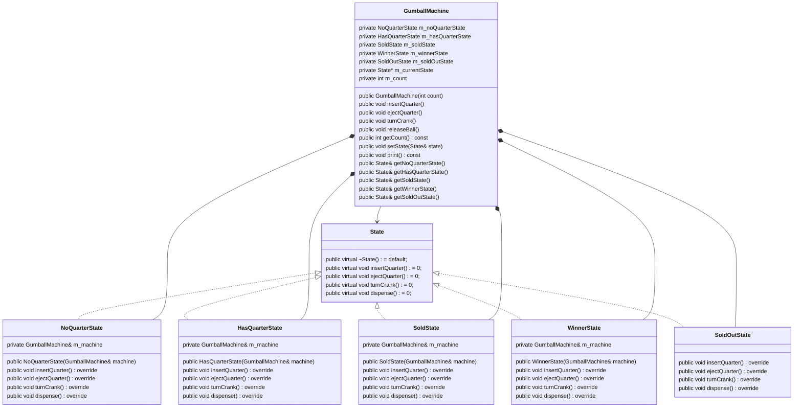
```mermaid
classDiagram

class State {
    public virtual ~State() = default;
    public virtual void insertQuarter() = 0;
    public virtual void ejectQuarter() = 0;
    public virtual void turnCrank() = 0;
    public virtual void dispense() = 0;
}

class NoQuarterState {
    public NoQuarterState(GumballMachine& machine)
    public void insertQuarter() override
    public void ejectQuarter() override
    public void turnCrank() override
    public void dispense() override
    private GumballMachine& m_machine
}

class HasQuarterState {
    public HasQuarterState(GumballMachine& machine)
    public void insertQuarter() override
    public void ejectQuarter() override
    public void turnCrank() override
    public void dispense() override
    private GumballMachine& m_machine
}

class SoldState {
    public SoldState(GumballMachine& machine)
    public void insertQuarter() override
    public void ejectQuarter() override
    public void turnCrank() override
    public void dispense() override
    private GumballMachine& m_machine
}

class WinnerState {
    public WinnerState(GumballMachine& machine)
    public void insertQuarter() override
    public void ejectQuarter() override
    public void turnCrank() override
    public void dispense() override
    private GumballMachine& m_machine
}

class SoldOutState {
    public void insertQuarter() override
    public void ejectQuarter() override
    public void turnCrank() override
    public void dispense() override
}

class GumballMachine {
    public GumballMachine(int count)
    public void insertQuarter()
    public void ejectQuarter()
    public void turnCrank()
    public void releaseBall()
    public int getCount() const
    public void setState(State& state)
    public void print() const
    public State& getNoQuarterState()
    public State& getHasQuarterState()
    public State& getSoldState()
    public State& getWinnerState()
    public State& getSoldOutState()
    private NoQuarterState m_noQuarterState
    private HasQuarterState m_hasQuarterState
    private SoldState m_soldState
    private WinnerState m_winnerState
    private SoldOutState m_soldOutState
    private State* m_currentState
    private int m_count
}

State <|.. NoQuarterState
State <|.. HasQuarterState
State <|.. SoldState
State <|.. WinnerState
State <|.. SoldOutState
GumballMachine *-- NoQuarterState
GumballMachine *-- HasQuarterState
GumballMachine *-- SoldState
GumballMachine *-- WinnerState
GumballMachine *-- SoldOutState
GumballMachine --> State
```

</details>

---

## Proxy Pattern

> The Proxy Pattern provides a surrogate or placeholder for another object to control access to it.

`RealImage` loads a file from disk in its constructor — an expensive operation. `ProxyImage` holds the same filename but defers construction of `RealImage` until the first `display()` call. `m_realImage` is `mutable` so `display()` can be `const` while still initializing on first use. Subsequent calls reuse the already-loaded `RealImage`. The client interacts with both through the same `Image` interface.

<details>
<summary>Class diagram</summary>

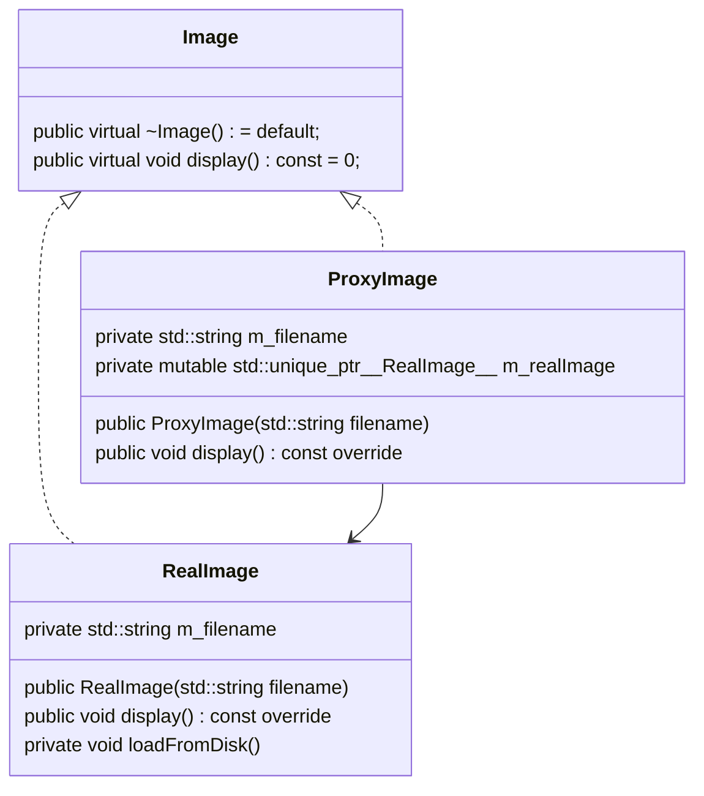
```mermaid
classDiagram

class Image {
    public virtual ~Image() = default;
    public virtual void display() const = 0;
}

class RealImage {
    public RealImage(std::string filename)
    public void display() const override
    private void loadFromDisk()
    private std::string m_filename
}

class ProxyImage {
    public ProxyImage(std::string filename)
    public void display() const override
    private std::string m_filename
    private mutable std::unique_ptr__RealImage__ m_realImage
}

Image <|.. RealImage
Image <|.. ProxyImage
ProxyImage --> RealImage
```

</details>
