# design-patterns

C++ examples for the book _Head First Design Patterns 2e._ Simplified to minimal examples and adapted to C++ conventions.

## Strategy Pattern

The Strategy Pattern defines a family of algorithms,
encapsulates each one, and makes them interchangeable.
Strategy lets the algorithm vary independently from
clients that use it.

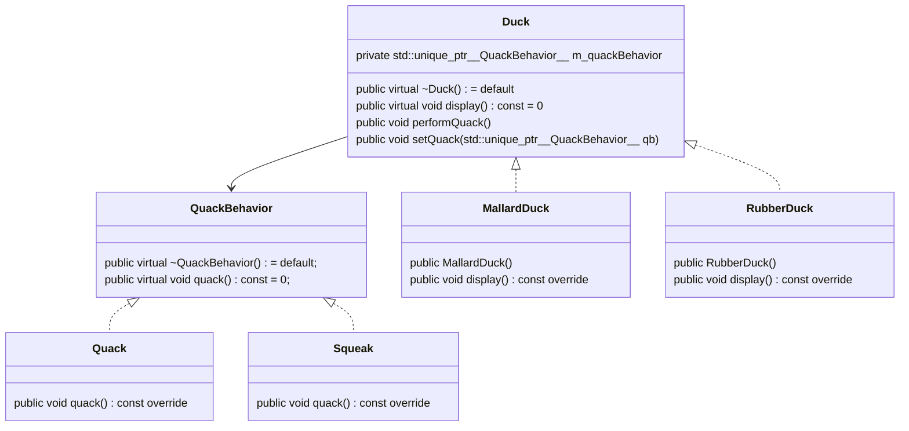
```mermaid
classDiagram

class QuackBehavior {
    public virtual ~QuackBehavior() = default;
    public virtual void quack() const = 0;
}

class Quack {
    public void quack() const override
}

class Squeak {
    public void quack() const override
}

class Duck {
    public virtual ~Duck() = default
    public virtual void display() const = 0

    public void performQuack()
    public void setQuack(std::unique_ptr__QuackBehavior__ qb)

    private std::unique_ptr__QuackBehavior__ m_quackBehavior
}

class MallardDuck {
    public MallardDuck()
    public void display() const override
}

class RubberDuck {
    public RubberDuck()
    public void display() const override
}

Duck <|.. RubberDuck
Duck <|.. MallardDuck
Duck --> QuackBehavior
QuackBehavior <|.. Quack
QuackBehavior <|.. Squeak
```

## Observer Pattern

The Observer Pattern defines a one-to-many dependency between objects so that when one object changes state, all of its dependents are notified and updated automatically.

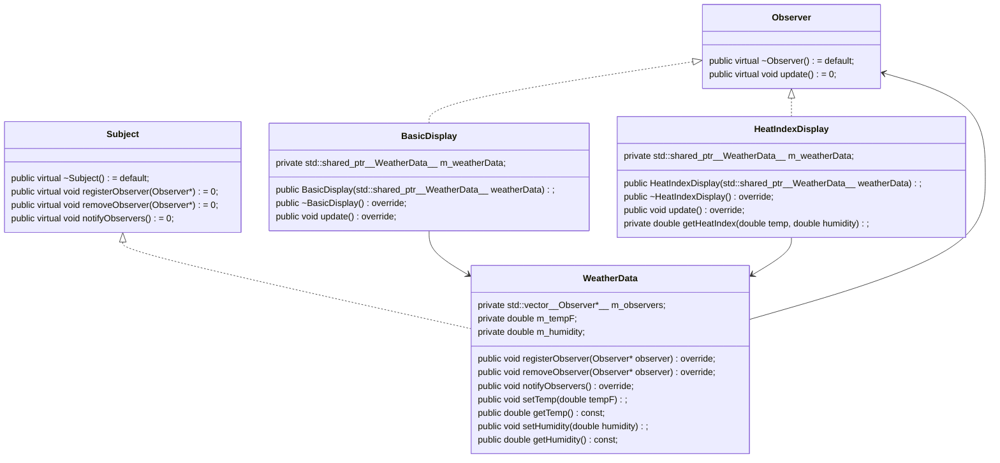
```mermaid
classDiagram

class Observer {
    public virtual ~Observer() = default;
    public virtual void update() = 0;
}

class Subject {
    public virtual ~Subject() = default;
    public virtual void registerObserver(Observer*) = 0;
    public virtual void removeObserver(Observer*) = 0;
    public virtual void notifyObservers() = 0;
}

class WeatherData {
    public void registerObserver(Observer* observer) override;
    public void removeObserver(Observer* observer) override;
    public void notifyObservers() override;
    public void setTemp(double tempF);
    public double getTemp() const;
    public void setHumidity(double humidity);
    public double getHumidity() const;

    private std::vector__Observer*__ m_observers;
    private double m_tempF;
    private double m_humidity;
}

class BasicDisplay {
    public BasicDisplay(std::shared_ptr__WeatherData__ weatherData);
    public ~BasicDisplay() override;
    public void update() override;

    private std::shared_ptr__WeatherData__ m_weatherData;
}

class HeatIndexDisplay {
    public HeatIndexDisplay(std::shared_ptr__WeatherData__ weatherData);
    public ~HeatIndexDisplay() override;
    public void update() override;

    private std::shared_ptr__WeatherData__ m_weatherData;
    private double getHeatIndex(double temp, double humidity);
}

Subject <|.. WeatherData
Observer <|.. BasicDisplay
Observer <|.. HeatIndexDisplay
WeatherData --> Observer
BasicDisplay --> WeatherData
HeatIndexDisplay --> WeatherData
```
## Decorator Pattern

The Decorator Pattern attaches additional responsibilities to an object dynamically. Decorators provide a flexible alternative to subclassing for extending functionality.

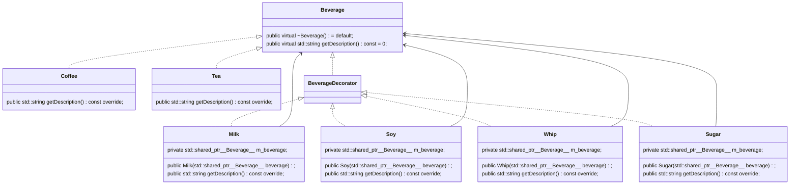
```mermaid
classDiagram

class Beverage {
    public virtual ~Beverage() = default;
    public virtual std::string getDescription() const = 0;
}

class Coffee {
    public std::string getDescription() const override;
}

class Tea {
    public std::string getDescription() const override;
}

class Milk {
    public Milk(std::shared_ptr__Beverage__ beverage);
    public std::string getDescription() const override;
    private std::shared_ptr__Beverage__ m_beverage;
}

class Soy {
    public Soy(std::shared_ptr__Beverage__ beverage);
    public std::string getDescription() const override;
    private std::shared_ptr__Beverage__ m_beverage;
}

class Whip {
    public Whip(std::shared_ptr__Beverage__ beverage);
    public std::string getDescription() const override;
    private std::shared_ptr__Beverage__ m_beverage;
}

class Sugar {
    public Sugar(std::shared_ptr__Beverage__ beverage);
    public std::string getDescription() const override;
    private std::shared_ptr__Beverage__ m_beverage;
}

Beverage <|.. Coffee
Beverage <|.. Tea
Beverage <|.. BeverageDecorator
BeverageDecorator <|.. Milk
BeverageDecorator <|.. Soy
BeverageDecorator <|.. Whip
BeverageDecorator <|.. Sugar
Milk --> Beverage
Soy --> Beverage
Whip --> Beverage
Sugar --> Beverage
```

## Factory Method Pattern

The Factory Method Pattern defines an interface for creating an object, but lets subclasses decide which class to instantiate. Factory Method lets a class defer instantiation to subclasses.

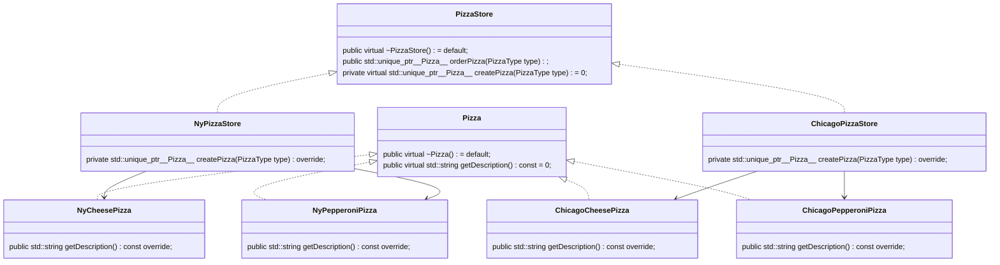
```mermaid
classDiagram

class Pizza {
    public virtual ~Pizza() = default;
    public virtual std::string getDescription() const = 0;
}

class NyCheesePizza {
    public std::string getDescription() const override;
}

class NyPepperoniPizza {
    public std::string getDescription() const override;
}

class ChicagoCheesePizza {
    public std::string getDescription() const override;
}

class ChicagoPepperoniPizza {
    public std::string getDescription() const override;
}

class PizzaStore {
    public virtual ~PizzaStore() = default;
    public std::unique_ptr__Pizza__ orderPizza(PizzaType type);
    private virtual std::unique_ptr__Pizza__ createPizza(PizzaType type) = 0;
}

class NyPizzaStore {
    private std::unique_ptr__Pizza__ createPizza(PizzaType type) override;
}

class ChicagoPizzaStore {
    private std::unique_ptr__Pizza__ createPizza(PizzaType type) override;
}

Pizza <|.. NyCheesePizza
Pizza <|.. NyPepperoniPizza
Pizza <|.. ChicagoCheesePizza
Pizza <|.. ChicagoPepperoniPizza
PizzaStore <|.. NyPizzaStore
PizzaStore <|.. ChicagoPizzaStore
NyPizzaStore --> NyCheesePizza
NyPizzaStore --> NyPepperoniPizza
ChicagoPizzaStore --> ChicagoCheesePizza
ChicagoPizzaStore --> ChicagoPepperoniPizza
```

## Abstract Factory Pattern

The Abstract Factory Pattern provides an interface for creating families of related or dependent objects without specifying their concrete classes.

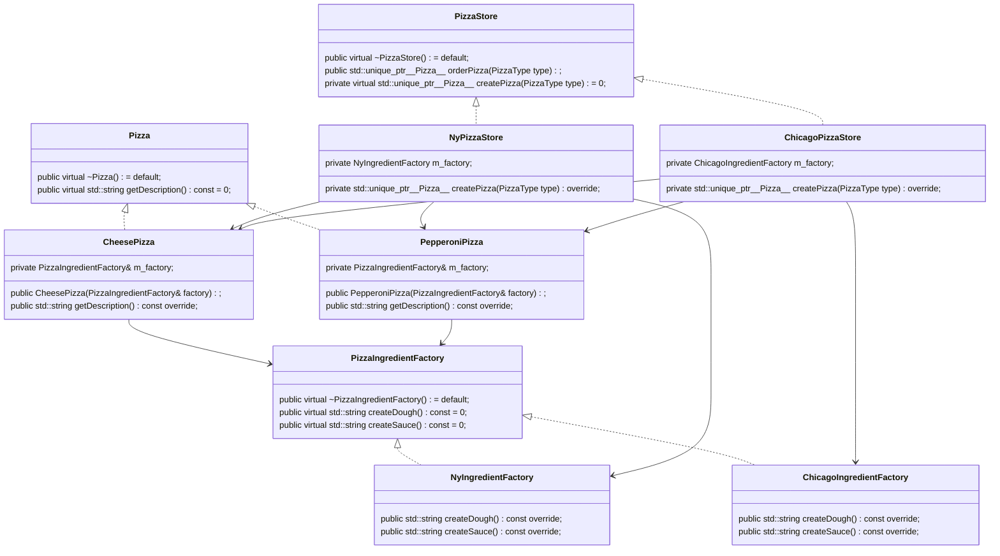
```mermaid
classDiagram

class PizzaIngredientFactory {
    public virtual ~PizzaIngredientFactory() = default;
    public virtual std::string createDough() const = 0;
    public virtual std::string createSauce() const = 0;
}

class NyIngredientFactory {
    public std::string createDough() const override;
    public std::string createSauce() const override;
}

class ChicagoIngredientFactory {
    public std::string createDough() const override;
    public std::string createSauce() const override;
}

class Pizza {
    public virtual ~Pizza() = default;
    public virtual std::string getDescription() const = 0;
}

class CheesePizza {
    public CheesePizza(PizzaIngredientFactory& factory);
    public std::string getDescription() const override;
    private PizzaIngredientFactory& m_factory;
}

class PepperoniPizza {
    public PepperoniPizza(PizzaIngredientFactory& factory);
    public std::string getDescription() const override;
    private PizzaIngredientFactory& m_factory;
}

class PizzaStore {
    public virtual ~PizzaStore() = default;
    public std::unique_ptr__Pizza__ orderPizza(PizzaType type);
    private virtual std::unique_ptr__Pizza__ createPizza(PizzaType type) = 0;
}

class NyPizzaStore {
    private std::unique_ptr__Pizza__ createPizza(PizzaType type) override;
    private NyIngredientFactory m_factory;
}

class ChicagoPizzaStore {
    private std::unique_ptr__Pizza__ createPizza(PizzaType type) override;
    private ChicagoIngredientFactory m_factory;
}

PizzaIngredientFactory <|.. NyIngredientFactory
PizzaIngredientFactory <|.. ChicagoIngredientFactory
Pizza <|.. CheesePizza
Pizza <|.. PepperoniPizza
PizzaStore <|.. NyPizzaStore
PizzaStore <|.. ChicagoPizzaStore
CheesePizza --> PizzaIngredientFactory
PepperoniPizza --> PizzaIngredientFactory
NyPizzaStore --> NyIngredientFactory
ChicagoPizzaStore --> ChicagoIngredientFactory
NyPizzaStore --> CheesePizza
NyPizzaStore --> PepperoniPizza
ChicagoPizzaStore --> CheesePizza
ChicagoPizzaStore --> PepperoniPizza
```

## Command Pattern

The Command Pattern encapsulates a request as an object, thereby letting you parameterize other objects with different requests, queue or log requests, and support undoable operations.

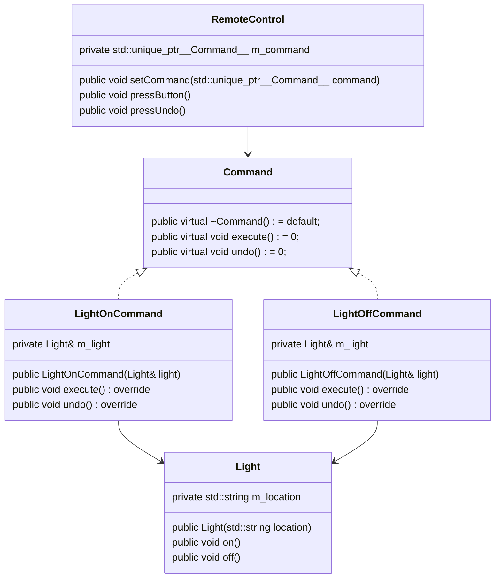
```mermaid
classDiagram

class Command {
    public virtual ~Command() = default;
    public virtual void execute() = 0;
    public virtual void undo() = 0;
}

class Light {
    public Light(std::string location)
    public void on()
    public void off()
    private std::string m_location
}

class LightOnCommand {
    public LightOnCommand(Light& light)
    public void execute() override
    public void undo() override
    private Light& m_light
}

class LightOffCommand {
    public LightOffCommand(Light& light)
    public void execute() override
    public void undo() override
    private Light& m_light
}

class RemoteControl {
    public void setCommand(std::unique_ptr__Command__ command)
    public void pressButton()
    public void pressUndo()
    private std::unique_ptr__Command__ m_command
}

Command <|.. LightOnCommand
Command <|.. LightOffCommand
LightOnCommand --> Light
LightOffCommand --> Light
RemoteControl --> Command
```

## Adapter Pattern

The Adapter Pattern converts the interface of a class into another interface clients expect. Adapter lets classes work together that couldn't otherwise because of incompatible interfaces.

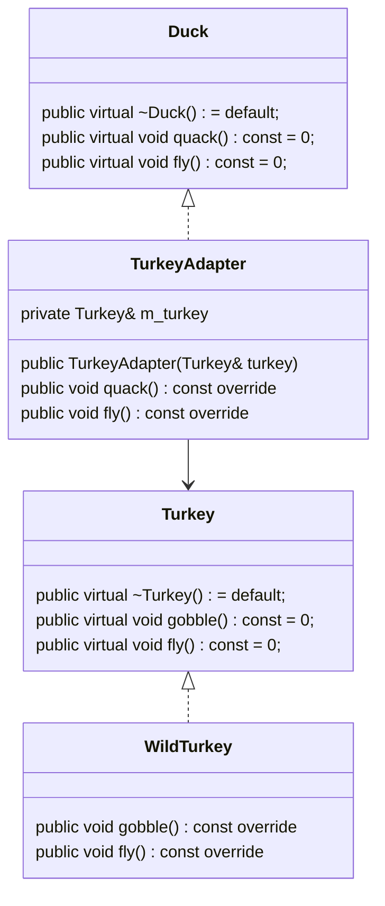
```mermaid
classDiagram

class Duck {
    public virtual ~Duck() = default;
    public virtual void quack() const = 0;
    public virtual void fly() const = 0;
}

class Turkey {
    public virtual ~Turkey() = default;
    public virtual void gobble() const = 0;
    public virtual void fly() const = 0;
}

class WildTurkey {
    public void gobble() const override
    public void fly() const override
}

class TurkeyAdapter {
    public TurkeyAdapter(Turkey& turkey)
    public void quack() const override
    public void fly() const override
    private Turkey& m_turkey
}

Duck <|.. TurkeyAdapter
Turkey <|.. WildTurkey
TurkeyAdapter --> Turkey
```

## Facade Pattern

The Facade Pattern provides a unified interface to a set of interfaces in a subsystem. Facade defines a higher-level interface that makes the subsystem easier to use.

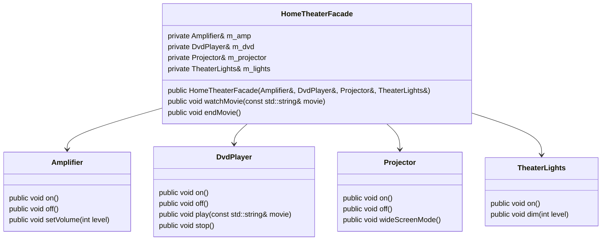
```mermaid
classDiagram

class Amplifier {
    public void on()
    public void off()
    public void setVolume(int level)
}

class DvdPlayer {
    public void on()
    public void off()
    public void play(const std::string& movie)
    public void stop()
}

class Projector {
    public void on()
    public void off()
    public void wideScreenMode()
}

class TheaterLights {
    public void on()
    public void dim(int level)
}

class HomeTheaterFacade {
    public HomeTheaterFacade(Amplifier&, DvdPlayer&, Projector&, TheaterLights&)
    public void watchMovie(const std::string& movie)
    public void endMovie()
    private Amplifier& m_amp
    private DvdPlayer& m_dvd
    private Projector& m_projector
    private TheaterLights& m_lights
}

HomeTheaterFacade --> Amplifier
HomeTheaterFacade --> DvdPlayer
HomeTheaterFacade --> Projector
HomeTheaterFacade --> TheaterLights
```

## Template Method Pattern

The Template Method Pattern defines the skeleton of an algorithm in a method, deferring some steps to subclasses. Template Method lets subclasses redefine certain steps of an algorithm without changing the algorithm's structure.

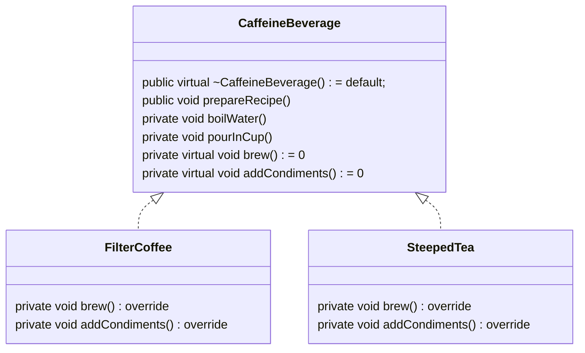
```mermaid
classDiagram

class CaffeineBeverage {
    public virtual ~CaffeineBeverage() = default;
    public void prepareRecipe()
    private void boilWater()
    private void pourInCup()
    private virtual void brew() = 0
    private virtual void addCondiments() = 0
}

class FilterCoffee {
    private void brew() override
    private void addCondiments() override
}

class SteepedTea {
    private void brew() override
    private void addCondiments() override
}

CaffeineBeverage <|.. FilterCoffee
CaffeineBeverage <|.. SteepedTea
```

## Iterator Pattern

The Iterator Pattern provides a way to access the elements of an aggregate object sequentially without exposing its underlying representation.

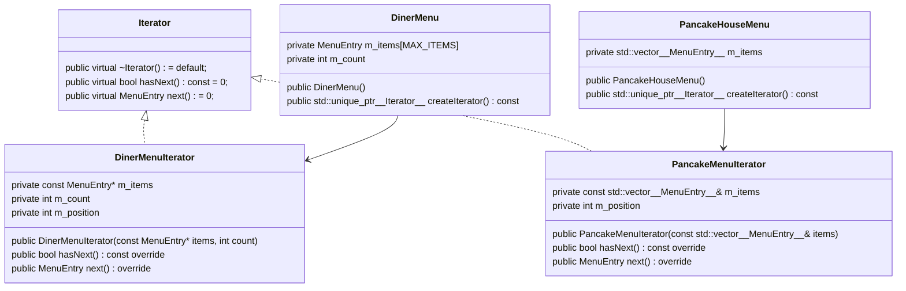
```mermaid
classDiagram

class Iterator {
    public virtual ~Iterator() = default;
    public virtual bool hasNext() const = 0;
    public virtual MenuEntry next() = 0;
}

class DinerMenu {
    public DinerMenu()
    public std::unique_ptr__Iterator__ createIterator() const
    private MenuEntry m_items[MAX_ITEMS]
    private int m_count
}

class DinerMenuIterator {
    public DinerMenuIterator(const MenuEntry* items, int count)
    public bool hasNext() const override
    public MenuEntry next() override
    private const MenuEntry* m_items
    private int m_count
    private int m_position
}

class PancakeHouseMenu {
    public PancakeHouseMenu()
    public std::unique_ptr__Iterator__ createIterator() const
    private std::vector__MenuEntry__ m_items
}

class PancakeMenuIterator {
    public PancakeMenuIterator(const std::vector__MenuEntry__& items)
    public bool hasNext() const override
    public MenuEntry next() override
    private const std::vector__MenuEntry__& m_items
    private int m_position
}

Iterator <|.. DinerMenuIterator
Iterator <|.. PancakeMenuIterator
DinerMenu --> DinerMenuIterator
PancakeHouseMenu --> PancakeMenuIterator
```

## Composite Pattern

The Composite Pattern allows you to compose objects into tree structures to represent part-whole hierarchies. Composite lets clients treat individual objects and compositions of objects uniformly.

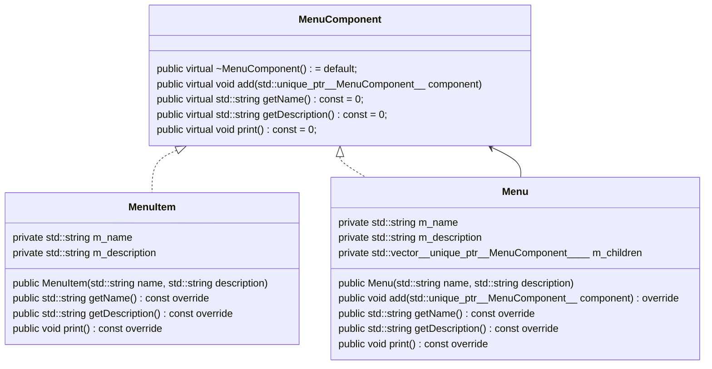
```mermaid
classDiagram

class MenuComponent {
    public virtual ~MenuComponent() = default;
    public virtual void add(std::unique_ptr__MenuComponent__ component)
    public virtual std::string getName() const = 0;
    public virtual std::string getDescription() const = 0;
    public virtual void print() const = 0;
}

class MenuItem {
    public MenuItem(std::string name, std::string description)
    public std::string getName() const override
    public std::string getDescription() const override
    public void print() const override
    private std::string m_name
    private std::string m_description
}

class Menu {
    public Menu(std::string name, std::string description)
    public void add(std::unique_ptr__MenuComponent__ component) override
    public std::string getName() const override
    public std::string getDescription() const override
    public void print() const override
    private std::string m_name
    private std::string m_description
    private std::vector__unique_ptr__MenuComponent____ m_children
}

MenuComponent <|.. MenuItem
MenuComponent <|.. Menu
Menu --> MenuComponent
```

## State Pattern

The State Pattern allows an object to alter its behavior when its internal state changes. The object will appear to change its class.

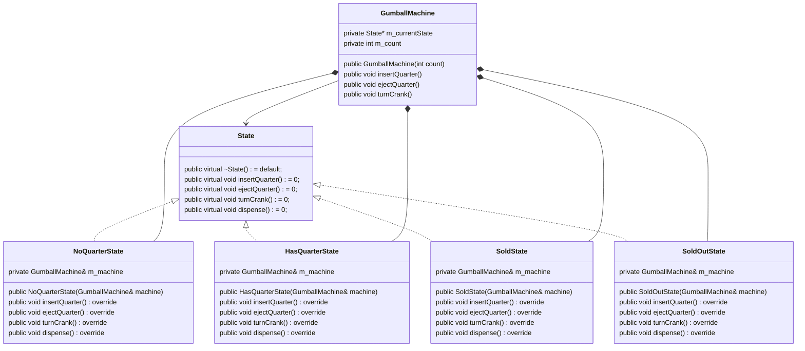
```mermaid
classDiagram

class State {
    public virtual ~State() = default;
    public virtual void insertQuarter() = 0;
    public virtual void ejectQuarter() = 0;
    public virtual void turnCrank() = 0;
    public virtual void dispense() = 0;
}

class NoQuarterState {
    public NoQuarterState(GumballMachine& machine)
    public void insertQuarter() override
    public void ejectQuarter() override
    public void turnCrank() override
    public void dispense() override
    private GumballMachine& m_machine
}

class HasQuarterState {
    public HasQuarterState(GumballMachine& machine)
    public void insertQuarter() override
    public void ejectQuarter() override
    public void turnCrank() override
    public void dispense() override
    private GumballMachine& m_machine
}

class SoldState {
    public SoldState(GumballMachine& machine)
    public void insertQuarter() override
    public void ejectQuarter() override
    public void turnCrank() override
    public void dispense() override
    private GumballMachine& m_machine
}

class SoldOutState {
    public SoldOutState(GumballMachine& machine)
    public void insertQuarter() override
    public void ejectQuarter() override
    public void turnCrank() override
    public void dispense() override
    private GumballMachine& m_machine
}

class GumballMachine {
    public GumballMachine(int count)
    public void insertQuarter()
    public void ejectQuarter()
    public void turnCrank()
    private State* m_currentState
    private int m_count
}

State <|.. NoQuarterState
State <|.. HasQuarterState
State <|.. SoldState
State <|.. SoldOutState
GumballMachine --> State
GumballMachine *-- NoQuarterState
GumballMachine *-- HasQuarterState
GumballMachine *-- SoldState
GumballMachine *-- SoldOutState
```

## Proxy Pattern

The Proxy Pattern provides a surrogate or placeholder for another object to control access to it.

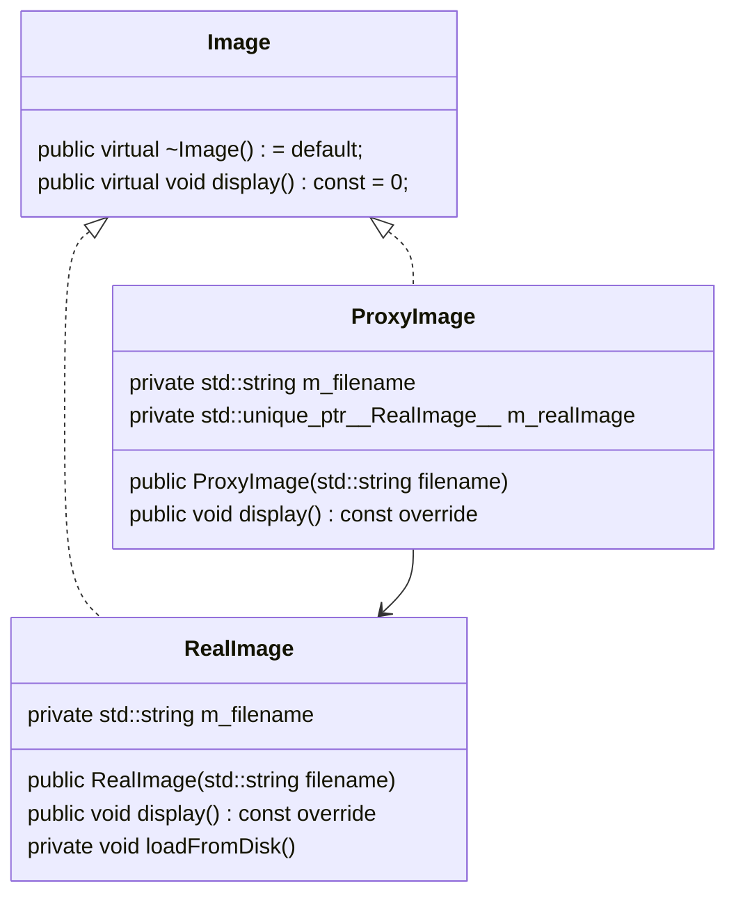
```mermaid
classDiagram

class Image {
    public virtual ~Image() = default;
    public virtual void display() const = 0;
}

class RealImage {
    public RealImage(std::string filename)
    public void display() const override
    private void loadFromDisk()
    private std::string m_filename
}

class ProxyImage {
    public ProxyImage(std::string filename)
    public void display() const override
    private std::string m_filename
    private std::unique_ptr__RealImage__ m_realImage
}

Image <|.. RealImage
Image <|.. ProxyImage
ProxyImage --> RealImage
```
